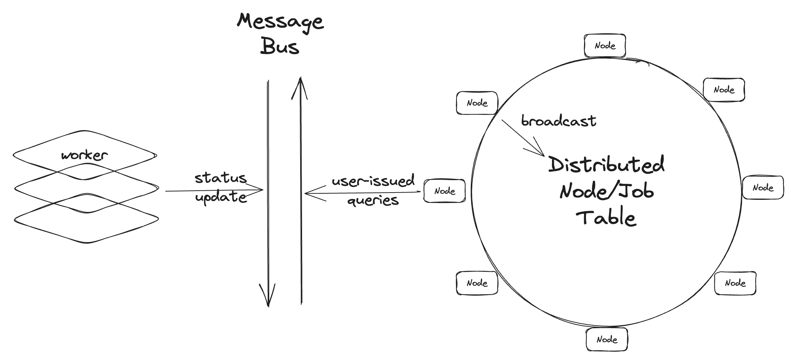

# Internals

Open Compute Framework is built on top of a concept named **Distributed Node Table**.

## Distributed Node Table

In layman's terms, it is a table that stores the information of all the nodes in the network. The table is distributed across all the nodes in the network, and each node stores a full copy of the table.

Each node in the network manages it's workers, which are the computing resources that the node can leverage. Once a worker is connected/disconnected to the node, the node will broadcast the information, including the underlying hardware of the node, the service it provides, and other metadata, to the network. All other nodes will receive the broadcast and update their local node table.

Once a node receives a user-issued query, it will look up the node table to find the "best" node to handle the query. The definition of "best" is hard and we are working on it. For now, we use a simple heuristic: **we randomly pick a node that claimed it provides the service that the user requested.**

With the distributed node table, we can achieve the following goals:

* **Decentralized**: There is no single point of failure. The node table is distributed across all the nodes in the network. If you like, you can host your own network and invite your friends to join.
* **Dynamic**: The node table is dynamic. It is updated whenever a node joins or leaves the network.
* **Efficient**: The node table is distributed across all the nodes in the network. Each node stores a full copy of the table, so that it can look up the table locally. This avoids the overhead of querying a centralized node table or a cascading node table.

It also comes with some drawbacks. Since we only broadcast the join/leave of workers, some newly joint node may not have a full view of the network. Hence, the node needs to sync itself with the network and it is something we are working on.

## Message Bus between Node and Workers

Each node manages a set of workers. The messaging between the node and the workers is done through a message bus. The message bus is implemented using [NATS](https://nats.io/), which is a lightweight and high-performance messaging system.

The message bus is used for managing the following tasks:

* **Node Status**: When a worker joins the network, it will send a message to the node to announce its presence. The node will then broadcast the message to the network.
* **Query Queue**: When a node receives a query, it will put the query into the message bus. The worker will then pick up the query from the message bus and process it.

## CAP Principles