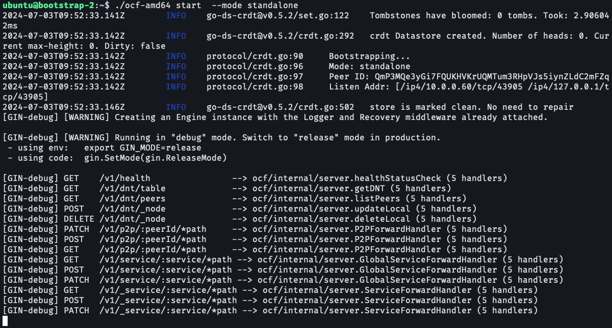

## Prerequisites

Spinning up a new global dispatcher requires the following prerequisites:

* A machine which is reachable by all the workers in the network (visible ip address, and make sure all ports are open).
* The hardware requirement is not high, as the global dispatcher is only responsible for routing the requests to the workers. A machine with 2 CPU cores and 4GB memory should be sufficient (but more memory is preferred).
* Make sure you have `make` installed on your machine.

## Install Open Compute Framework

### Install by Downloading the Binary

1. Download the binary from the [release page](https://github.com/researchcomputer/OpenComputeFramework/releases). There are pre-built binaries for both `amd64` and `arm64` architectures.

### (Alternatively) Install by Building from Source

1. To build from source, you need to have `go` (tested with `go-1.22.5`) installed on your machine. Full installation guide can be found [here](https://go.dev/doc/install). On Linux, you can install `go` by running the following command:

```
wget https://go.dev/dl/go1.22.5.linux-amd64.tar.gz
rm -rf /usr/local/go && tar -C /usr/local -xzf go1.22.5.linux-amd64.tar.gz # you may need sudo
export PATH=$PATH:/usr/local/go/bin
```
and verify the installation by
```
go version
```

2. Clone the repository:

```bash
git clone https://github.com/autoai-org/OpenComputeFramework.git
cd OpenComputeFramework/src/
make build
```

It will automatically resolve the dependencies and build the binary. The binary will be generated in the `bin/` directory.

## Run the Global Dispatcher

Start the global dispatcher with the following command (under the directory where you have the binary):

```bash
./ocf-amd64 start  --mode standalone
```

:::tip[Standalone Mode]
Standalone mode means that the global dispatcher will not connect to any other nodes. It will only wait for the workers to connect to it.
:::

It will start the global dispatcher on port `8092` and show the following output:
```
2024-07-03T09:52:33.141Z	INFO	go-ds-crdt@v0.5.2/set.go:122	Tombstones have bloomed: 0 tombs. Took: 2.906042ms
2024-07-03T09:52:33.142Z	INFO	go-ds-crdt@v0.5.2/crdt.go:292	crdt Datastore created. Number of heads: 0. Current max-height: 0. Dirty: false
2024-07-03T09:52:33.142Z	INFO	protocol/crdt.go:90	Bootstrapping...
2024-07-03T09:52:33.142Z	INFO	protocol/crdt.go:96	Mode: standalone
2024-07-03T09:52:33.142Z	INFO	protocol/crdt.go:97	Peer ID: QmP3MQe3yGi7FQUKHVKrUQMTum3RHpVJs5iynZLdC2mFZq
2024-07-03T09:52:33.142Z	INFO	protocol/crdt.go:98	Listen Addr: [/ip4/10.0.0.60/tcp/43905 /ip4/127.0.0.1/tcp/43905]
2024-07-03T09:52:33.146Z	INFO	go-ds-crdt@v0.5.2/crdt.go:502	store is marked clean. No need to repair
[GIN-debug] [WARNING] Creating an Engine instance with the Logger and Recovery middleware already attached.

[GIN-debug] [WARNING] Running in "debug" mode. Switch to "release" mode in production.
 - using env:	export GIN_MODE=release
 - using code:	gin.SetMode(gin.ReleaseMode)

[GIN-debug] GET    /v1/health                --> ocf/internal/server.healthStatusCheck (5 handlers)
[GIN-debug] GET    /v1/dnt/table             --> ocf/internal/server.getDNT (5 handlers)
[GIN-debug] GET    /v1/dnt/peers             --> ocf/internal/server.listPeers (5 handlers)
[GIN-debug] POST   /v1/dnt/_node             --> ocf/internal/server.updateLocal (5 handlers)
[GIN-debug] DELETE /v1/dnt/_node             --> ocf/internal/server.deleteLocal (5 handlers)
[GIN-debug] PATCH  /v1/p2p/:peerId/*path     --> ocf/internal/server.P2PForwardHandler (5 handlers)
[GIN-debug] POST   /v1/p2p/:peerId/*path     --> ocf/internal/server.P2PForwardHandler (5 handlers)
[GIN-debug] GET    /v1/p2p/:peerId/*path     --> ocf/internal/server.P2PForwardHandler (5 handlers)
[GIN-debug] GET    /v1/service/:service/*path --> ocf/internal/server.GlobalServiceForwardHandler (5 handlers)
[GIN-debug] POST   /v1/service/:service/*path --> ocf/internal/server.GlobalServiceForwardHandler (5 handlers)
[GIN-debug] PATCH  /v1/service/:service/*path --> ocf/internal/server.GlobalServiceForwardHandler (5 handlers)
[GIN-debug] GET    /v1/_service/:service/*path --> ocf/internal/server.ServiceForwardHandler (5 handlers)
[GIN-debug] POST   /v1/_service/:service/*path --> ocf/internal/server.ServiceForwardHandler (5 handlers)
[GIN-debug] PATCH  /v1/_service/:service/*path --> ocf/internal/server.ServiceForwardHandler (5 handlers)
2024-07-03T09:53:33.147Z	INFO	protocol/clock.go:17	Starting verification
2024-07-03T09:54:33.147Z	INFO	protocol/clock.go:17	Starting verification
```


You can find your peer ID in the output. Remember to keep it as it will be used by the workers to connect to the global dispatcher.

### Ports

- REST API: `8092` (HTTP)
- LibP2P: `43905/tcp`, `43905/tcp/ws`, `59820/udp/quic`

### Run as a public bootstrap

If your node has a publicly reachable IP, set it so other peers can discover you as a bootstrap:

```bash
./ocf-amd64 start \
  --public-addr=<your-public-ip> \
  --mode node
```

## Connect Workers to the Global Dispatcher

To connect the workers to the global dispatcher, you need to start the workers (on the worker node) with the following command:

```bash
./ocf-amd64 start --bootstrap.addr=/ip4/<ip-of-global-dispatcher>/tcp/43905/p2p/<PeerID-of-global-dispatcher>
```

Once connected, you can view:
- **All nodes in the network** (including disconnected ones): http://<ip addr of global dispatcher>:8092/v1/dnt/table
- **Only actively connected peers**: http://<ip addr of global dispatcher>:8092/v1/dnt/peers


## Next Steps

You have successfully spun up a new global dispatcher and connected workers to it. You can now start using the global dispatcher to route requests to the workers. For example, to use OpenAI-compatible APIs, you can setup the OpenAI Client as:

```
client = OpenAI(
    base_url = "http://<dispatcher-ip>:8092/v1/service/llm/v1",
    api_key = "any",
)
```

Note: The `llm` service routes to any provider that has registered the requested `model`.